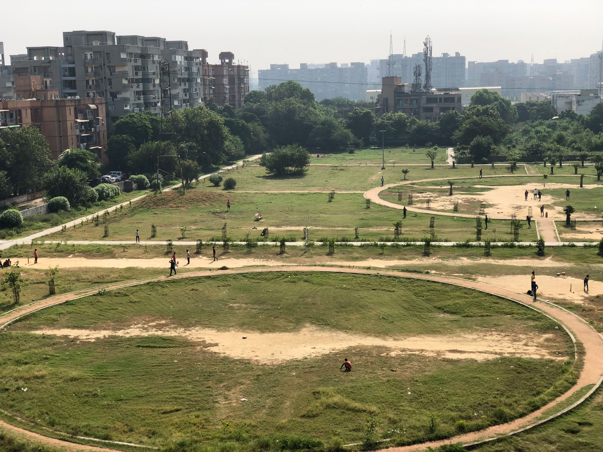

# Project to detect person in a image

Input: 

Output: 

## Steps to be followed to run the project

- Download the project folder to local machine
- Install the requirements:(python 3.6+)
  - pip install -r requirements.txt
- Download [yolov3.weights](https://pjreddie.com/media/files/yolov3.weights) and place it in the weights folder before running the project
- In the project folder, please run
  - python detect.py
- After you run the code, view the output image in "output" folder